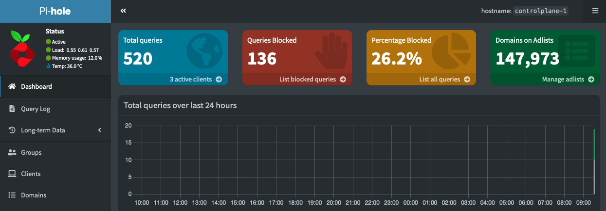

# PiHole Kubernetes Ansible Configuration



This Ansible playbook configures a PiHole server on each member of the "piholes" group in the inventory. The servers are deployed on Kubernetes, which must be previously configured, and exposed on port 53 using NodePort.

## Prerequisites

- Kubernetes cluster is set up on target machines
- The machine where the playbook is run is able deploy to it
- Ansible is installed on the machine where you run the playbook.

## Usage

1. Clone this repository:

   ```bash
   git clone https://github.com/your-username/pihole-k8s-ansible.git
   cd pihole-k8s-ansible
   ```

2. Update the `inventory` file with the IP addresses of the hosts in the "piholes" group.

3. Configure the necessary variables in `main.yml`:

   - `TZ`: Set the timezone for the PiHole server.
   - `WEBPASSWORD`: Set the PiHole admin password.

4. Run the Ansible playbook:

   ```bash
   ansible-playbook -i inventory.ini main.yml -K
   ```

5. Setup your Network or Device DNS to use the IP addresses of the hosts in the "piholes" group.

## Configuration Details

- The PiHole server is based on the [docker-pi-hole](https://github.com/pi-hole/docker-pi-hole) image.
- More configuration information can be found in the official [docker-pi-hole repository](https://github.com/pi-hole/docker-pi-hole).
- The PiHole server is exposed on port 53 using NodePort.
- The IP of the Ansible hosts can be configured as the DNS for devices on the local network.
- Multiple members can be added to the "piholes" group in the inventory for redundancy.

## Variables

- `TZ`: Timezone for the PiHole server.
- `WEBPASSWORD`: PiHole admin password.

## Author

Michael Budnick

## License

This project is licensed under the MIT License - see the [LICENSE](LICENSE) file for details.
